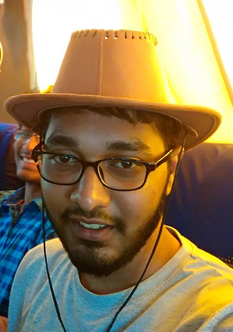

---

Hi! I'm a Senior year undergrad student at IIIT-H majoring in Computer Science.My interests lie in Deep Reinforcement Learning,Computer Vision and Image processing.

I am currently working at [ Dreamvu inc. ](http://dreamvu.com/) as a Research assistant.I have worked on calibrating the videos captured from the coffee-filter mirror to panoramic stereo videos in real-time.

I'm working under the guidance of [Dr. Girish Varma](https://geevi.github.io) on learning Visual servoying using Reinforcement Learning.
